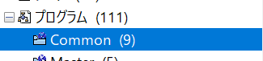
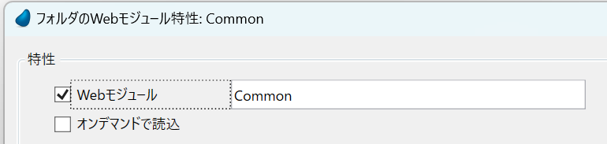
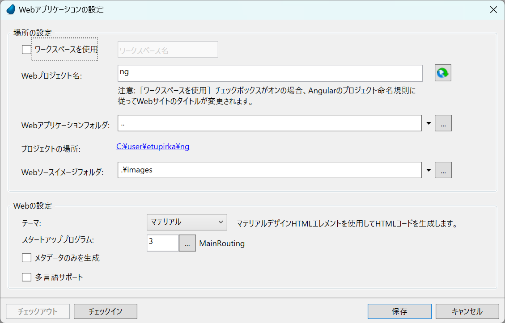

# IISの設定
**【重要】Magic xpa をインストールする前にIISの導入･設定をお願いいたします。**
https://www.magicsoftware.co.jp/service/support/manual/magicxpa4/Install.pdf
の82ページを参照してください。

# Magicのインストール

https://www.magicsoftware.co.jp/service/support/manual/magicxpa4/Install.pdf
の13ページを参照してください。


# コマンドライン
npm i –g npm

**npm config set legacy-peer-deps true** ← とっても忘れがち


# プロジェクトフォルダの作成
\プロジェクト名\mg\の中にシステムを構築してください。

# Magicプロジェクトの作成
\プロジェクト名\mg\の中にプロジェクトを構築してください。

ezoプロジェクトならば

\ezo\mg\ezo.edpが来ます。

# 差分iniファイルの作成

\プロジェクト名\mg\プロジェクト名.iniを作成します。

例) C:\user\ezo\mg\ezo.ini

詳しくはヘルプの

ホーム > Magic xpa 逆引き辞典 > 開発環境 > Magc.ini の環境情報を追加指定するには

内容例)

```ini
;デフォルトプロジェクト
/DefaultProject   = C:\user\ezo\mg\ezo.edp
/StartApplication = C:\user\ezo\mg\ezo.ecf

;デフォルトデータベース
/DefaultDatabase = ezo
;MSSQL設定(Windows認証)
/[MAGIC_DATABASES]ezo = DBMS, 21, ezo, , MSJ-WS-01, ,,, NoMagicRecordL+
ock, ChangeFileInToolkit, CheckDefinition, CheckKey, NoFileLocks, , , +
CheckExist, 0, , NoAS400SrvrSort,
;論理名
/[MAGIC_LOGICAL_NAMES]ExecEnv=C:\\user\\ezo\\mg\\ExecEnv\\
```


# ショートカットの作成
オーバライドを使用する

次に、Magic xpa Studio 起動時にこの設定ファイルを読み込ませる指定が必要です。以下の構文で指定します。

Magic xpa.exe file @Override File Name

例えば以下のように設定できます。

"C:\Program Files\Magic xpa\Studio\MgxpaStudio.exe" C:\user\ezo\mg\ezo.ini


# メインフォルダの作成


フォルダを作成します。名前をCommonとします。



**Webモジュール**だけにチェックを付けます。

# メインルーティングの作成

## Webアプリケーションの設定

Webプロジェクト名 **ng**
Webアプリケーションフォルダ **..**
テーマ マテリアル
