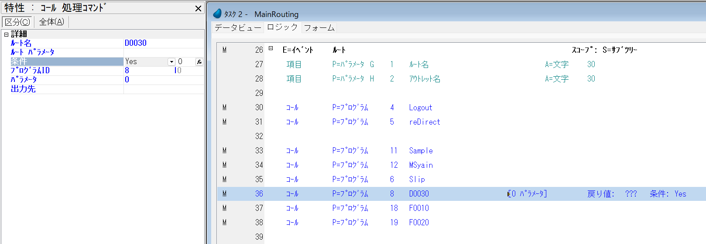

# IISの設定
**【重要】Magic xpa をインストールする前にIISの導入･設定をお願いいたします。**
https://www.magicsoftware.co.jp/service/support/manual/magicxpa4/Install.pdf
の82ページを参照してください。

# Magicのインストール

https://www.magicsoftware.co.jp/service/support/manual/magicxpa4/Install.pdf
の13ページを参照してください。


# コマンドライン
npm i –g npm

**npm config set legacy-peer-deps true** ← とっても忘れがち


# プロジェクトフォルダの作成

例)C:\userにetupirkaプロジェクトを構築します。


# オーバライドiniファイルの作成

\プロジェクト名\プロジェクト名.iniを作成します。

例) C:\user\etupirka\etupirka.ini

詳しくはヘルプの

ホーム > Magic xpa 逆引き辞典 > 開発環境 > Magc.ini の環境情報を追加指定するには

内容例)

```ini
;デフォルトプロジェクト
/DefaultProject   = C:\user\etupirka\etupirka.edp
/StartApplication = C:\user\etupirka\etupirka.ecf

;デフォルトデータベース
/DefaultDatabase = etupirka
;MSSQL設定(Windows認証)
/[MAGIC_DATABASES]etupirka = DBMS, 21, etupirka, , MSJ-WS-01, ,,, NoMagicRecordL+
ock, ChangeFileInToolkit, CheckDefinition, CheckKey, NoFileLocks, , , +
CheckExist, 0, , NoAS400SrvrSort,
;論理名
/[MAGIC_LOGICAL_NAMES]ExecEnv=C:\\user\\etupirka\\etupirka\\
```

# ショートカットの作成
オーバライドを使用する

次に、Magic xpa Studio 起動時にこの設定ファイルを読み込ませる指定が必要です。以下の構文で指定します。

Magic xpa.exe file @Override File Name

例えば以下のように設定できます。

"C:\Program Files\Magic xpa\Studio\MgxpaStudio.exe" C:\user\etupirka\etupirka.ini


# メインフォルダの作成


フォルダを作成します。名前をCommonとします。


**Webモジュール**だけにチェックを付けます。
オンデマンドに関しては外します。

# メインルーティングの作成


MainRoutingにはイベント「ルート」を追加します。



サブフォームを追加しルーターアウトレット「True」、デフォルトアウトレット「True」を設定します。

## このサブフォーム内に各プログラムが表示されて動きます。


## Webアプリケーションの設定

Webプロジェクト名 **ng**
Webアプリケーションフォルダ **.**
テーマ マテリアル

スタートアッププログラムに先ほど追加したMainRoutingプログラムを指定します。


ここでWebアプリケーションの作成を行います。


user\etupirkaフォルダの下にAngularのngフォルダが出来ています。


