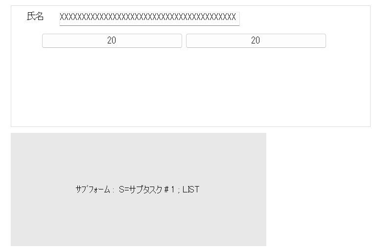
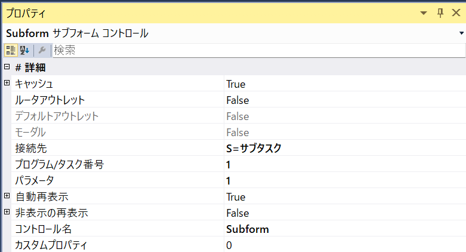
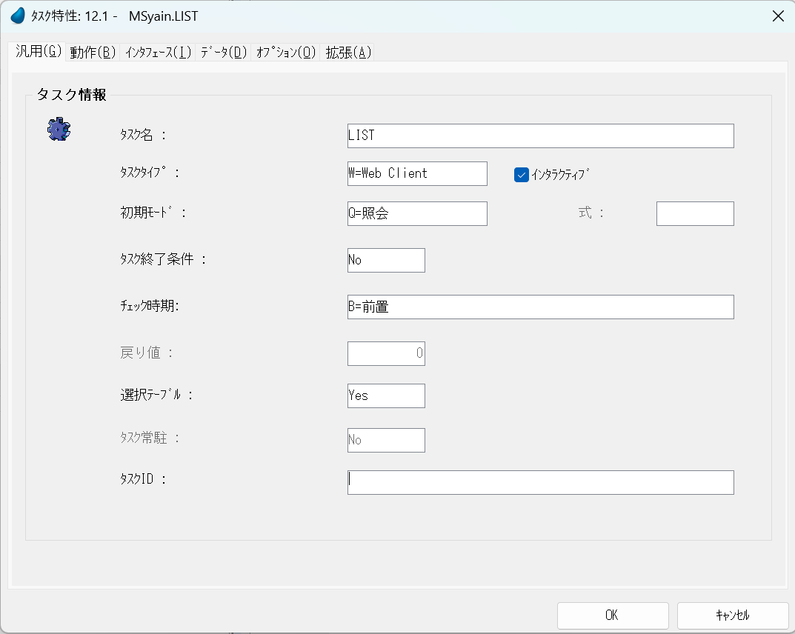

# 一覧参照


## 内容
条件(氏名)を入力し絞り込みをクリックすることで条件抽出を行い一覧に表示します。

基本ですが、応用として他プログラムからコールされる選択プログラムに使ったり、ここから編集画面へ飛んだりと使えます。


## タスク構造


### タスク説明

#### MSyain

条件を入力、ボタン押下でLISTをリロード

#### LIST

条件に従って一覧を表示


## MSyain

タスク特性


タスクタイプ：WebClient


更新確認：No


ルート：MSyain

これで http://xxxxxxx/MSyain でアクセスできます。


トランザクションモード：なし

空のでデータビュー許可：No

## データビュー


## ロジック

V.名称に入力してBSELECTボタンを押すと


サブフォームを再表示します。

## フォーム



### サブフォームのプロパティ




## LIST

### タスク特性


一覧参照なので照会モード


更新がないのでトランザクションモード：なし

空のデータビュー許可：Yes

事前読込：Yes


### データビュー


M社員マスタをメインソースとして指定

名称の範囲としてパラメータのPi名称を使用して**Trim(Pi名称)&'*'**と前方一致で指定を行う。

パラメーターは**MSyainタスクの名称**と連携を取っている。

### フォーム


テーブルはマテリアルデザイングリッド

サーバー先行読込:True

## 選択プログラム

例えば社員コードでズームし、社員マスタを表示、選択して戻り値を渡す場合は

### MSyainタスク


受け取り、渡しパラメーターを設定します。

### LISTタスク




選択テーブルをYesにする


ボタンをクリックすることで選択したことにします。


選択テーブルをYesにしたことで、選択するとプログラムを終わろうとします。つまりレコ後を通るのでMSyainのPioParamを社員コードの値で項目更新します。

## 複雑な条件設定

条件が単純なAND文程度であれば範囲にて行えるのですが複雑な場合はSQLを構築する場合が多いです。


メインソースをSQLコマンドに変更いたします。


SQLには

```
SELECT 得意先コード,得意先名
FROM 得意先マスタ
WHERE 得意先コード = 得意先コード
:1
:2
```
と記述されています。そしてこの:1や:2を入力パラメータとして指定いたします。

:1には

```
if(B=3,' or 得意先ｺｰﾄﾞ = ' & ASCIIChr(39) & TRIM(A) & ASCIIChr(39),'')
```

:2には

```
if(C=3,' or 得意先名 LIKE %' & ASCIIChr(39) & TRIM(A) & '%' & ASCIIChr(39),'')
```

といったようにあいまい検索やSQLのWHERE句を積み重ねています。

戻り値には
SELECTの位置と変数があうように設定します。


## SQLコマンドはストアドプロシージャも可能
EXEC ? = TEST2 :1

例として以下のストアドプロシージャの戻り値を設定することも可能です。

```
ALTER PROCEDURE [dbo].[TEST2] 
@aaa nvarchar(30)
AS
BEGIN
      SET NOCOUNT ON;
      SELECT 得意先ｺｰﾄﾞ,得意先名1 FROM M得意先マスタ WHERE 得意先名1 LIKE '%'+ @aaa + '%' ;
END
```