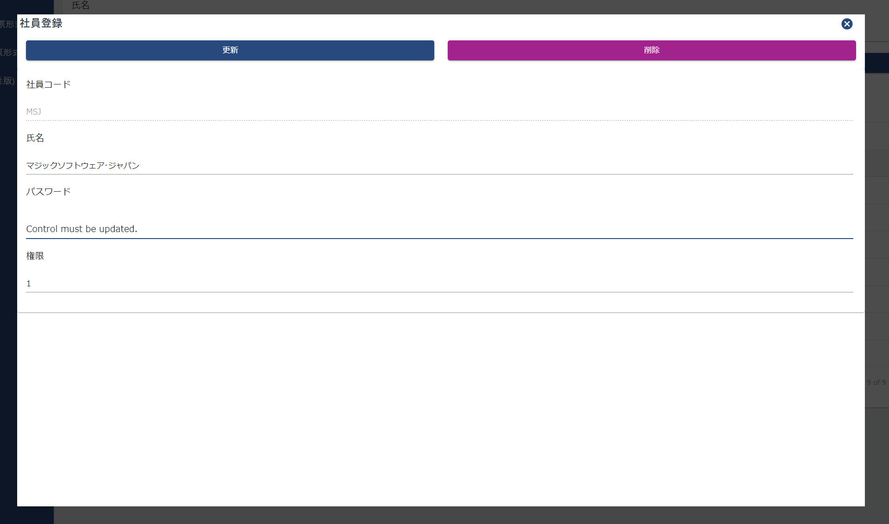
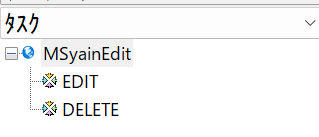
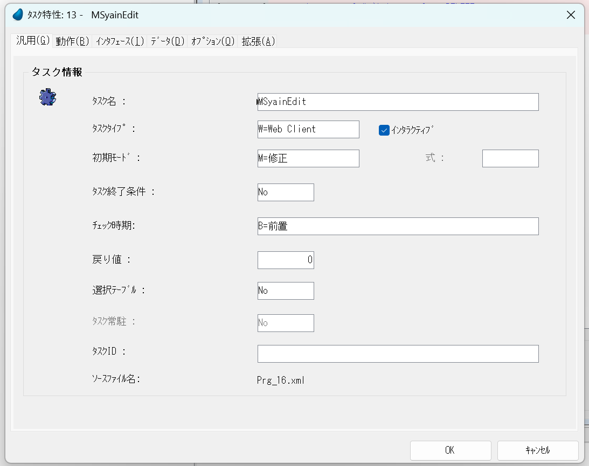
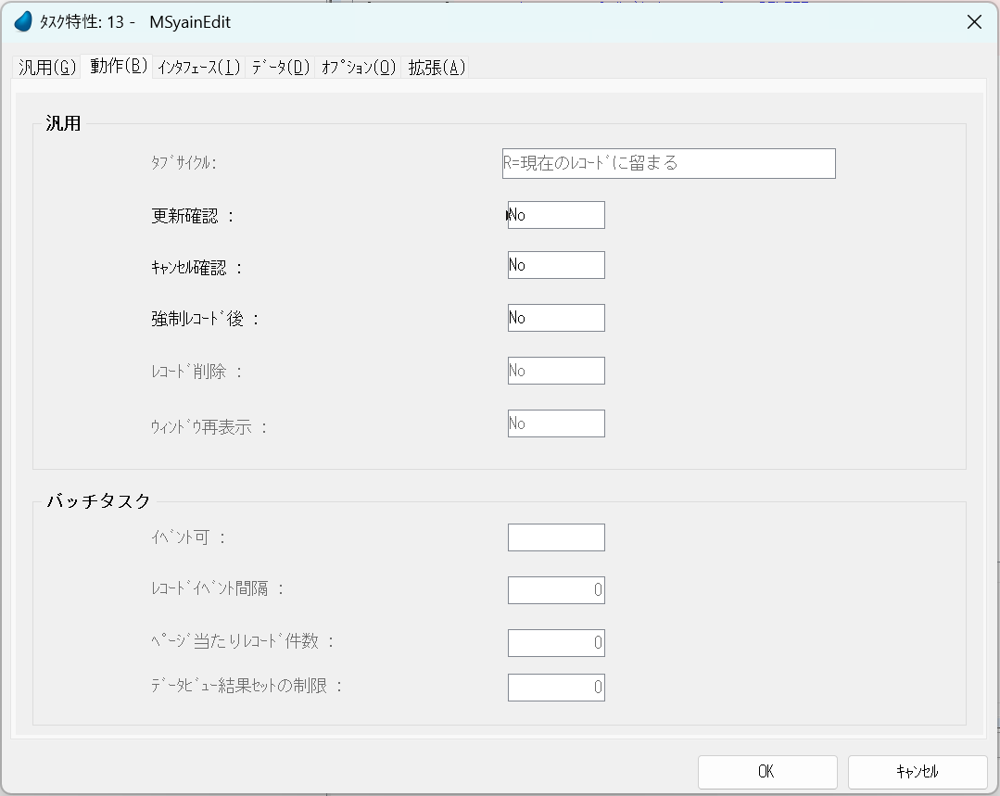
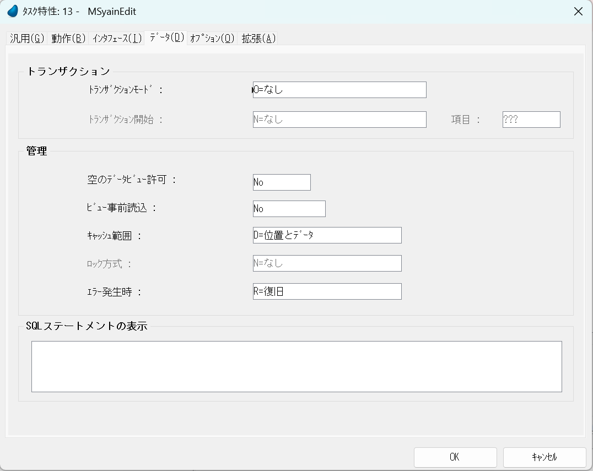
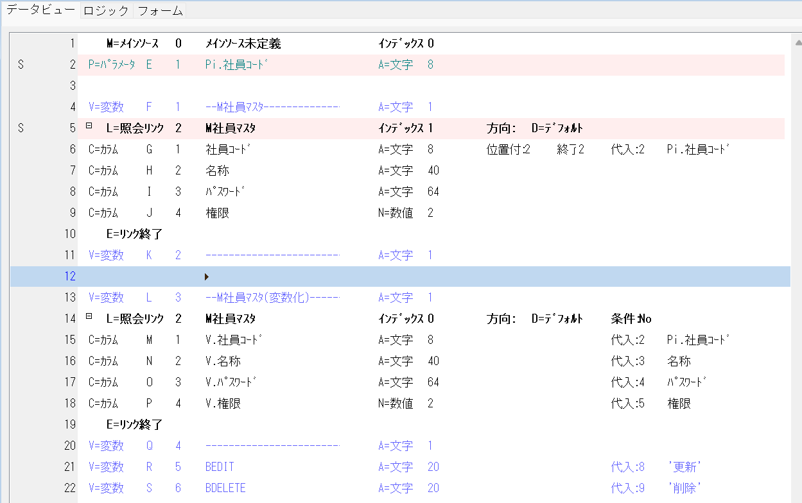
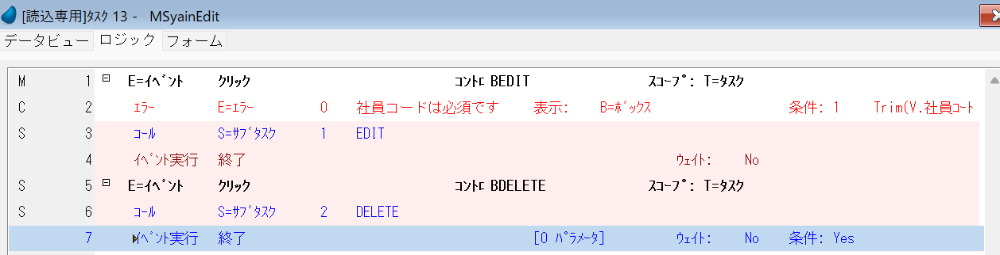
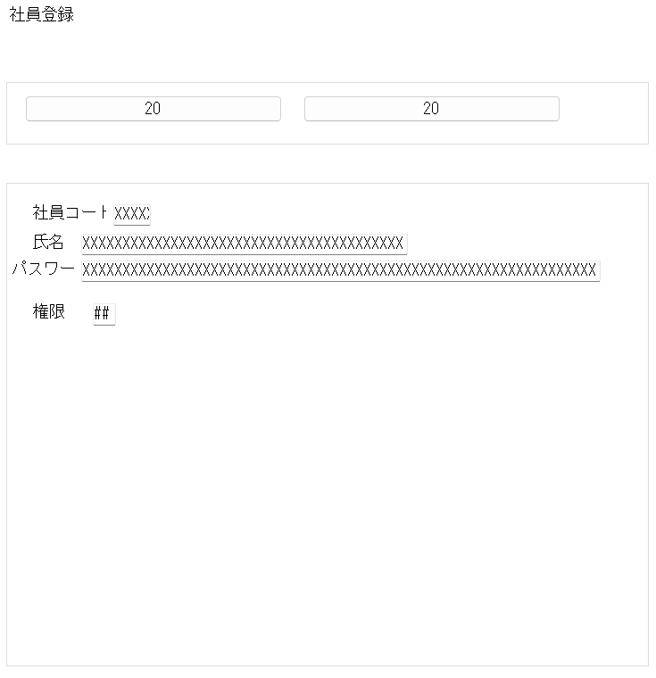

# 単票形式

## 内容
パラメーターを受け、データを位置づけ、変数に展開します。

伝票番号0とデータがない場合は展開する変数がないため、空白になります。

更新ボタンを押した場合は修正バッチ、削除の場合は削除バッチを動かして修了いたします。

## タスク構造

### タスク説明

#### MSyainEdit

パラメーターを受け、データを位置づけ、変数に展開します。

#### Edit

条件に従って修正登録します。

#### DELETE

条件に従って削除を行います。

## MSyainEdit

初期モード修正

更新確認：No

トランザクションモード：なし

直接データベースに書き込まず、変数を使うのでトランザクションモードは"なし"となっています。

### データビュー

Pi(パラメータイン)で社員コードを受け取ります。

照会リンクでM社員マスタを社員コードPi.社員コードで位置づけします。

その値を変数に代入します。

更新ボタンと、削除ボタンを作成します。

### ロジック

BEDITボタンをクリックした場合と、BDELETEボタンをクリックした場合のイベントを作成します。

## フォーム

このように、特にきれいに並べる必要はありません。

