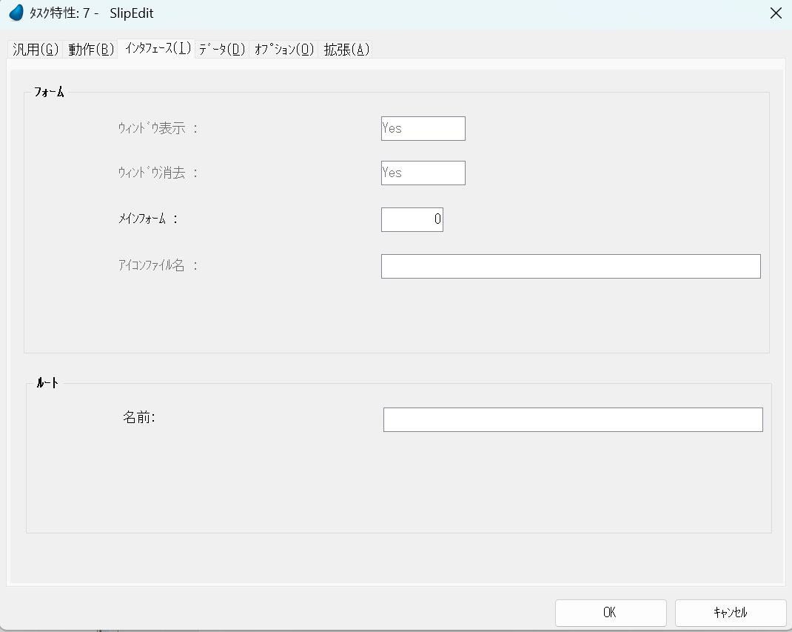
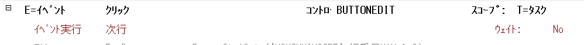

# 伝票形式


## 内容
ヘッダ情報は単票形式と同様に変数を使用したタスクとなります。
明細はメモリテーブルを使用したタスクとなります。

情報系などの場合は直接データベースとやり取りを行ってもよいのですが販売管理などの場合で修正する場合
```
①トランザクションデータ削除前に現在の元データにて在庫を戻す

②トランザクションデータの削除

③トランザクションデータの追加

④トランザクションデータを元に在庫を減らす
```
といった流れを作るためにメモリテーブルをワークファイルとして使用しています。


## タスク構造


### タスク説明

#### SlipEdit

パラメーターを受け、データを位置づけ、変数に展開します。

#### Meisai

明細部分を修正します。

#### 行挿入処理①②

最下行などではなく途中行へ行挿入を行っても連番を保つ処理です。

#### 行削除処理①②

途中行を削除しても連番を保つ処理です。

#### 更新処理

データ確定後、トランザクションデータへの反映処理となります。

①ヘッダトランザクションデータの削除を行います

ヘッダデータの削除を行います。

②明細削除

明細トランザクションデータの削除を行います

③ヘッダ更新

変数項目であるヘッダ部分をトランザクションデータに反映させます。

④明細更新

メモリテーブルの明細ファイルをトランザクションデータに反映させます。


## SlipEdit


更新確認をNoにする




トランザクション：なし

空のデータビュー許可：No

キャッシュ範囲：なし

### データビュー


売伝一覧からの受け取りパラメーター。新規追加の場合は0が入ります。

更新フラグ、更新ボタン、削除ボタンを用意します。

更新フラグは「更新しますか？」に対して「はい」「いいえ」の戻り値に使用します。


パラメーターを元に伝票ヘッダデータを位置づけします。

新規登録は0なので位置づけする場所がありません。


変数に代入します。


得意先マスタを伝票の得意先コードで参照します。

### ロジック


受け取った伝票番号を元に明細ワークファイルを構築します。


更新ボタンをクリックすると「更新しますか？」と聞いたのちに「はい｣を選択した場合、更新処理へ進みます。

更新処理には'T'logを渡します。


削除ボタンをクリックすると問答無用で更新処理へ進みます。

更新処理には'F'logを渡します。


得意先コードのズーム処理時に動きます。

得意先一覧参照プログラムに参照渡しで得意先コードを渡します。


パラメーターを渡すとき相手タスクで変えてほしい(戻してほしい)時は項目を指定して変数やデータを設定します。

渡したまま戻してほしくないときは式に入れています。

戻してほしくないときにも"項目"に設定して渡すことはできますが、間違いのもとになるため、私は式に設定しています。

### フォーム


基本は単票形式ですがズームボタンについて説明します。

得意先の項目で「ズームボタンを表示」をTrueにすると


このように項目の右側にボタンが設置され、クリックすると「ズーム」イベント発生させます。


サブフォームとしてMeisaiタスクを指定しています。

パラメータの関連付けとしてSlipEditタスクのPi.伝票番号とMeisaiのPi.伝票番号を関連づけています。

自動再表示がTrueになっていますのでSlipEditタスクのPi.伝票番号が変更されるとMeisaiタスクはリロードされます。

ここがFalseの場合はコールサブタスクで呼ぶか、イベント「サブフォーム再表示」でリロードする必要があります。


## Meisai


トランザクションモード：新規の遅延トランザクション

トランザクション開始：レコード前の前

空のデータビュー許可：Yes

ビュー事前読込：Yes

キャッシュ範囲：位置とデータ

メモリテーブルにアクセス、確定させるためトランザクションを使用します。

レコードに入る前にトランザクションを開始し、レコードを抜けた段階でトランザクションを確定するようにします。

新規登録時、1行目は空白レコードを表示するので空のデータビューを許可しています。

### データビュー


SlipEditタスクとの連携させるパラメータにはPi.伝票番号を指定。

行挿入、行削除、行編集の確定ボタンの定義を行っています。


行の新規追加時に新規行番号を取得するために最後の行番号を求めています。

行番号がキーである明細データに対して「逆方向」、位置づけデータは何もないため「一番最後の行」を取得してます。

一番最後の行の「行番号」つまり最終行番号をここで求めています。


新規行の場合、最終行行番号+1を代入しています。

### ロジック


ズームイベントによって商品コードを取得し、データリンクを行っている商品マスタの単価を明細ワークの単価へ代入します。




編集確定ボタンをおすと、次行へ移動させます。

これによりレコード後処理を通るので行確定を行います。


行挿入イベントです

条件はその行が修正モードです(Stat(0,'M'Mode))。新規追加したものに関しては確定しない限り行追加はできません。

#### 行挿入の流れ
処理が2つに別れています。

①で行挿入する行以降に対して降順で行番号+1します。

降順の理由は昇順だと最初の行で+1するとキーの重複を起すからです。

②で自分の行の下に行を追加します。

③データ再表示を行います。


削除ボタンイベント

行削除イベントを発生させます


OKでしたらレコード後へ移動します。


項目更新がYESになっております。

これは現在の「税抜金額合計」に金額を加算するという方法をとります。

項目更新で「税抜金額合計」に対して「税抜金額合計」+「金額」という構築方法はおこないません。

#### Stat(0,'D'MODE)：削除モードの場合

行削除イベントを発生させ「ＯＫ」を選択するとレコード後は削除モードとなります。

行削除ですので、処理を説明いたします。

①"削除する"自分の行を0行目に変更する

②自分の行以降の行を昇順にならべて行番号を-1する。

### フォーム


メモリテーブルの内容を並べました。


## バッチ①


SlipEditタスクのタスク前からコールされます。

メモリテーブルの削除を行い、トランザクションファイルからメモリテーブルへデータをコピーします。

## バッチ②


### 更新処理

ヘッダで設定した変数、明細で設定したメモリテーブルの内容をトランザクションデータへ反映させます。


という訳でトランザクションをかけます。

このタスクが始まる前から終わるまでです。エラーが起きたときはロールバックします。

即データのロックをかけます。


削除時、更新時とも削除は行いますが更新フラグがTrueの場合のみ更新を行います。
