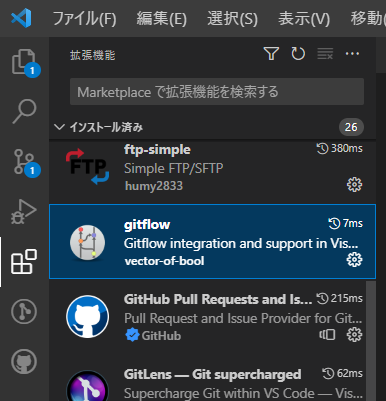
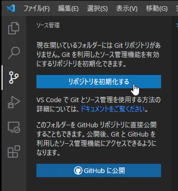
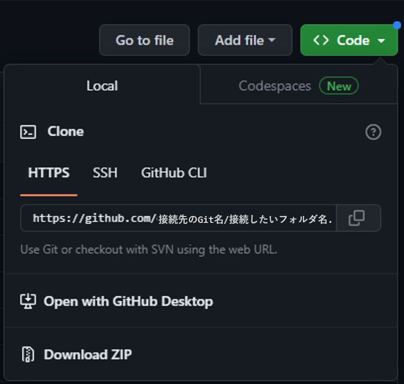
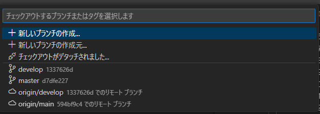
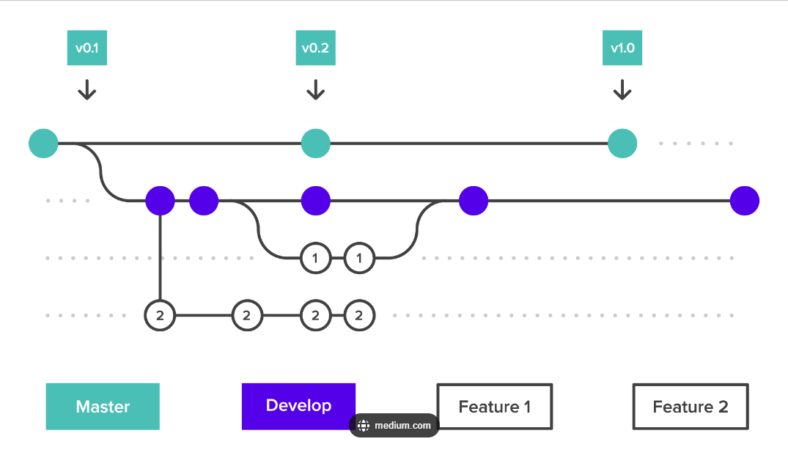
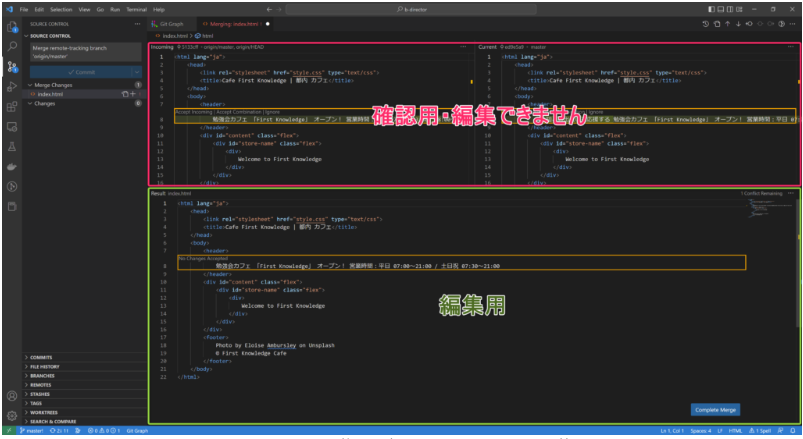
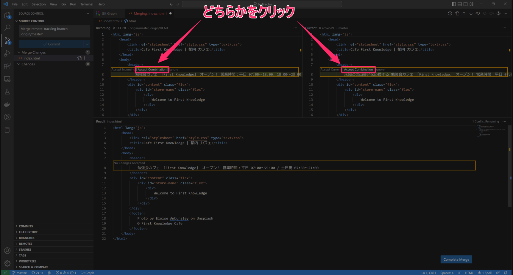
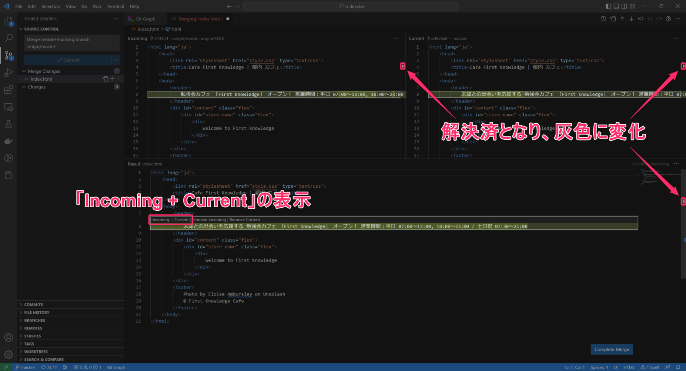
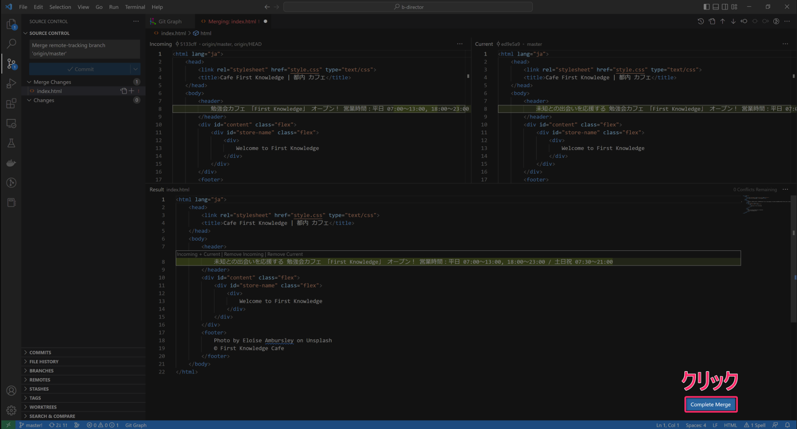

# Step1 Git flow プラグインの導入

### 概要リンク

[git-flow プラグイン](https://marketplace.visualstudio.com/items?itemName=vector-of-bool.gitflow)

## VS コードからインストール

1. 拡張機能メニューを開く
1. 検索フォームから「gitflow」を検索する
1. インストールする

## 基本的な使い方

1. Ctrl+Shift+P を押してコマンドパレットを表示
1. 「gitflow」を入力します
1. git-flow の各メニューが表示される（feature ブランチ、release ブランチの作成など）

# Step2 Git hub との同期を設定する

## トークンが必要な場合（20230621 更新）

1. リポジトリを初期化するのは同じ
1. ターミナルを開く（Ctrl+@）も同じ
1. C:\USER\開いているフォルダ名>の右隣に入力する URL が変わります  
   「git remote add origin https://ユーザー名：トークン＠github.com/接続先の Git 名/接続したいフォルダ名.git」を入力します。これで GitHub とのつながりができました。
1. main にいる状態で「pull origin 【develop】」を入力  
   【】の中にいれるのはファイルが置いてあるブランチ名を入れます。
1. Ctrl+Shift+P を押してコマンドパレットを表示
1. 「Gitflow : Initialize repository for gitflow 」を探し Enter
1. 「main」「develop」などの表示が何も表示されなくなるまで Enter を繰り返し押す
1. 画面左下のアイコンの「master」をクリック ⇒「develop」へ移動する(上の処理が終わったときに develop へ移動しているかもしれません)
1. 左下のアイコンに「develop」と書いてあることを確認する

## 同期するフォルダを準備する

1. Git hub 上のフォルダ名と同じフォルダーをローカルに作成する
   　（例：C:\USER\ProjectA など）
1. 作成したフォルダを VS コードで開く（右クリック＞ VS コードで開く）
1. メニューのソース管理から「リポジトリを初期化する」ボタンをクリック  
     
   ※初期化後の「ブランチの発行」ボタンは押さなくてよいです
1. ターミナルを開く（Ctrl+@）
1. C:\USER\開いているフォルダ名>の右隣に「git remote add origin https\://github.com/接続先の Git 名/接続したいフォルダ名.git」を入力する  
   ※接続したいフォルダ内の Code を参照
   
1. すぐ下の行に「git pull origin master」を入力する
1. Ctrl+Shift+P を押してコマンドパレットを表示
1. 「Gitflow : Initialize repository for gitflow 」を探し Enter
1. 「main」「develop」などの表示が何も表示されなくなるまで Enter を繰り返し押す
1. 画面左下のアイコンの「master」をクリック ⇒「develop」へ移動する  
   
1. 左下のアイコンに「develop」と書いてあることを確認する

## ファイルの編集方法

1. ファイルの編集開始ごとにプルを行う
   ( ※develop の位置にいることを確認する )  
   
1. コンフリクトが起こるタイミングその ①
   1. 判断ができない場合：チームと打合せ ⇒ 次のステップへ進む
   1. 判断ができる場合：次のステップへ進む
1. Ctrl+Shift+P を押してコマンドパレットを表示
1. 「Gitflow : Feature: start」を選択して、ファイルの編集始めを宣言する
   ※develop から Feature ブランチを派生させることで  
   コンフリクトしたときに差分の管理をしやすくします。  
   以下の画像を参照
   
1. 編集を終えたら保存をする
1. コメントを付けてコミットする(ステージが必要な場合はステージをしてから)
1. Ctrl+Shift+P を押してコマンドパレットを表示
1. 「Gitflow : Feature: finish」を選択し、終了を宣言する  
   (この時点で Feature から develop の位置に戻る)
1. 更新をし、develop の本流と一本化する

## 注意点

- 編集前に「develop」を選択していることを確認する
- 編集前にプルして同期をとる  
  (チームで別の人が変更している可能性があるため、最新版と一致させる)
-
-

## コンフリクトの修正方法

1. コンフリクトが発生した時点で、「マージエディタで解決」というボタンが VS コードの右下に出現する
1. クリックすると３分割された画面が出現する  
   
1. 画面上部の競合部分で、Incoming Current どちら側でもよいので、[Accept Combination] をクリック  
   
1. 画面下部の競合部分が変更され、競合発生箇所を示す表示が灰色に変化する  
   
1. 両方の編集内容が反映されていることを確認する
1. 画面下部 [Complete Merge] ボタンをクリックして保存する  
   
1. 更新内容がステージされていることを確認する  
   (※ステージがされていない場合は「＋」を押すとステージされる)
1. メッセージを追加しコミットする(マージが完了)

# Angular での作成･修正がある場合

## まず feature ブランチや Bugfix ブランチの作成を行います。

## 修正します。

## ブランチを完了させます
