# 新規プロジェクトを作成する

まずはヘルプの「ホワイトペーパー」→「Magic xpaをGitリポジトリに接続」の説明を読むとわかりやすいです。

## GitHubでのプロジェクトの作成方法

Magicxpa用とAngular用のプログラムを作成します。

https://github.com/〇〇〇 へ移動する

Newをクリックする

Repository nameを[プロジェクト名+Magic]とします。

例) MSJMagic

オプションですがDescriptionの設定もおこないます。

**必ずPrivateにチェックをつけてください**。Publicにするとソースが外部に解放されます。

リポジトリを構築します。

いつでも参照可能ですが右側のURLを控えておきます。

## MagicでGitで管理させるプロジェクトを起動させます。

新規プロジェクトの場合は[0100環境構築]('0100環境構築.md')を読んでください。

設定ボタンをクリックして

**C:\Program Files (x86)\Magic Compare 4\merge.exe**

を指定する。

[Getting Started with Gitの**P13**からお読みください]('https://devnet.magicsoftware.co.jp/images/skillup/magic/download/xpa4/Getting_Started_with_Magic_Git.pdf')

### PowerShellなどコマンドラインにて

Magicの mg.edp が存在するフォルダへ移動して

git remote add origin https://github.com/ezostyle/MSJTest.git

これでGitの接続性がすべてクリアになっているかと思います。

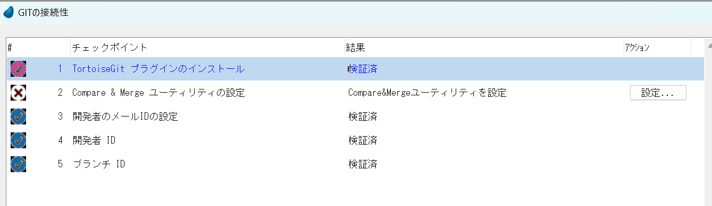

Magicを起動すると次のメッセージがでますのでOKを押してください。

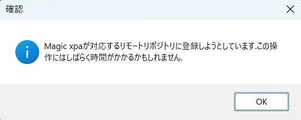

## masterブランチを作成します

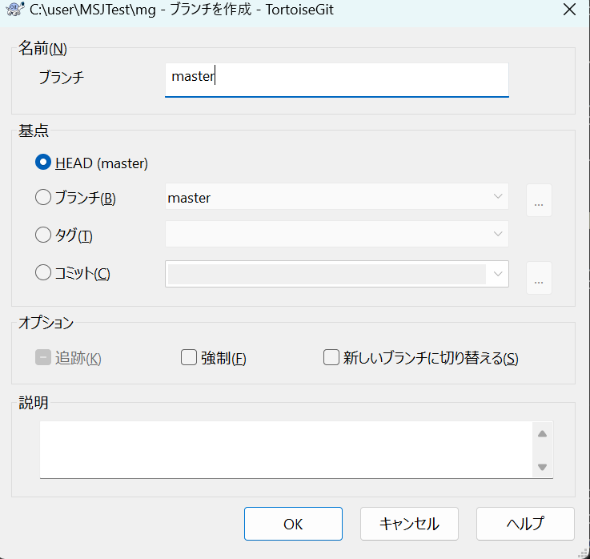

## Git Flowの構築

一度コミットする

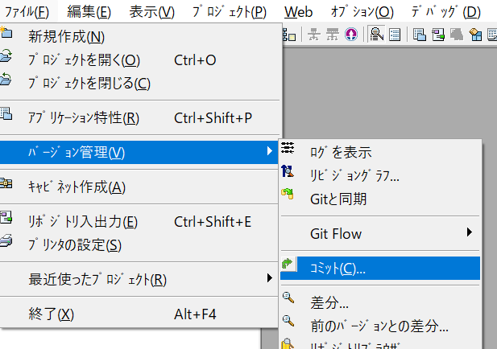

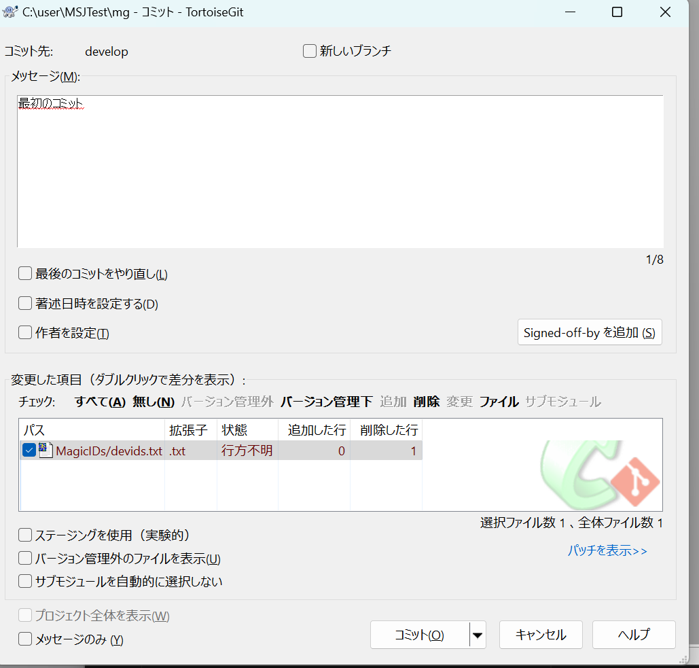

プッシュします

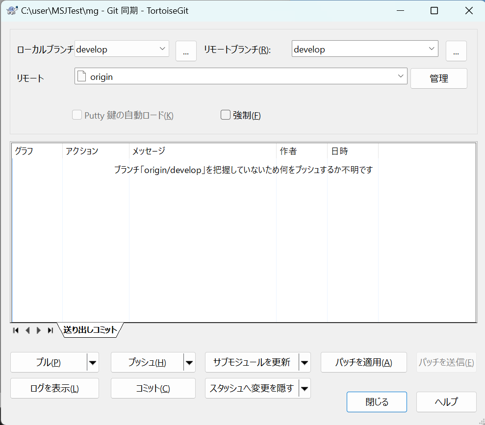

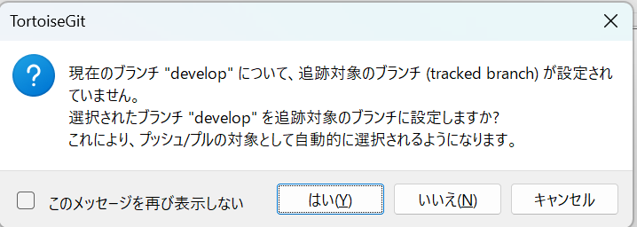

masterブランチとdevelopブランチをGithubにて作成します

https://github.com/グループ名/プロジェクト名/branches

New branchをクリックします。

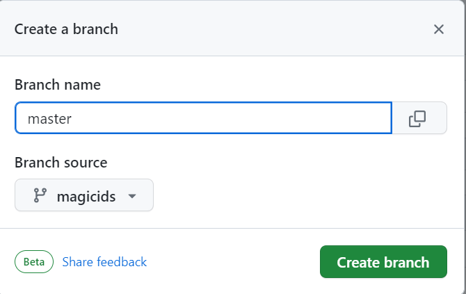

**同様にdevelopも作成します**

GitFlowの初期化を行う

## githubにある既存のシステムと同期をとる

プロジェクト名 / mgフォルダと

プロジェクト名 / ngフォルダを構築する

バージョン管理→Gitリポジトリのクローンを選択する

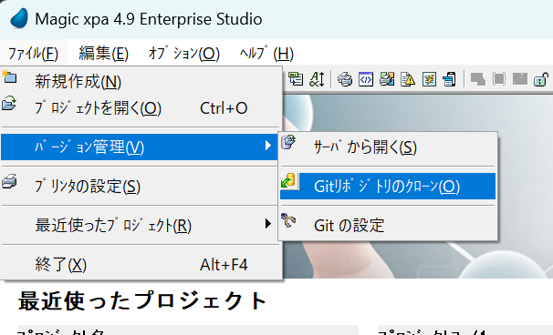

gitHubに設定されているURLと同期先を設定します。
developブランチと同期を取ります。

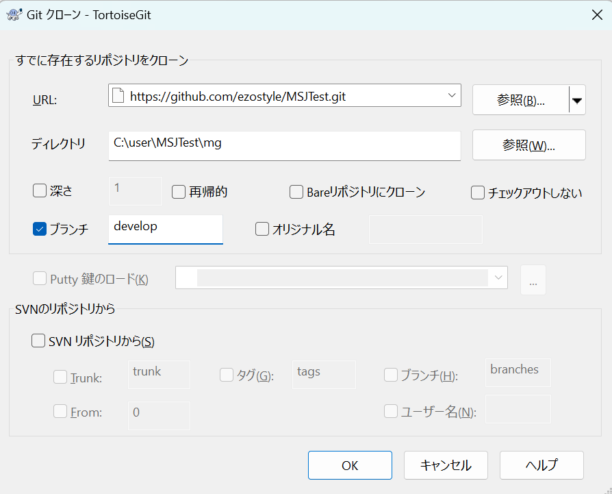

同期がとられました

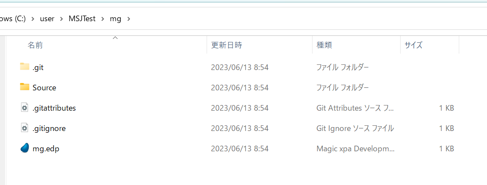