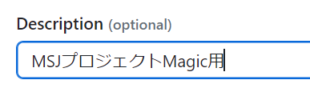
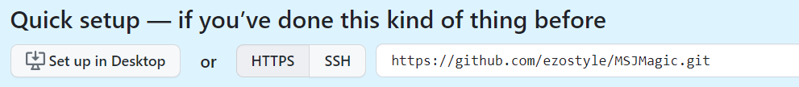
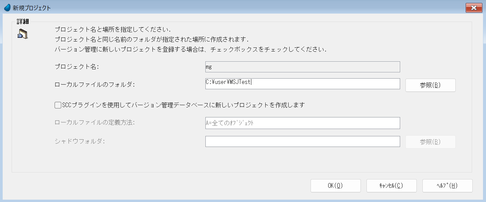
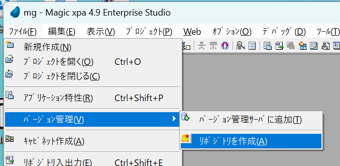
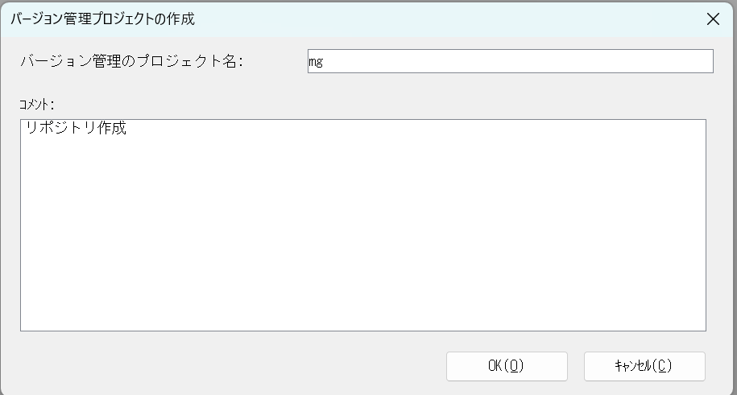
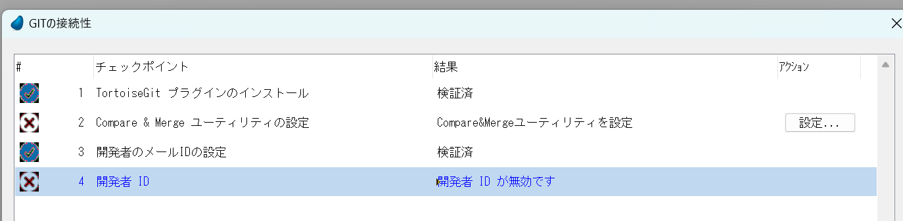
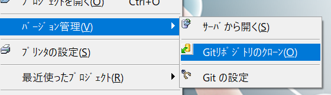
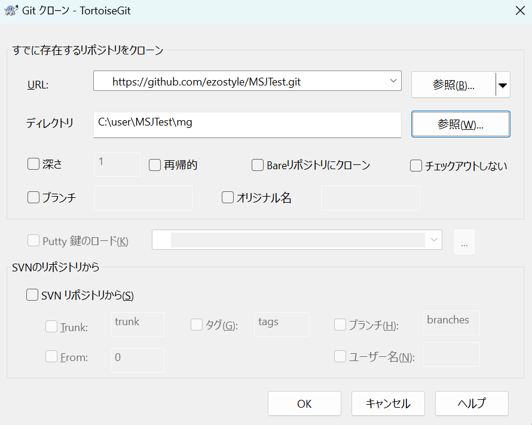
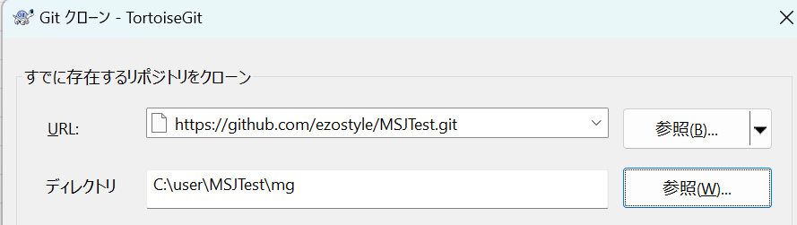

# 新規プロジェクトを作成する
## GitHub
Magicxpa用とAngular用のプログラムを作成します。

https://github.com/〇〇〇 へ移動する

Newをクリックする

Repository nameを[プロジェクト名+Magic]とします。

例) MSJMagic

オプションですがDescriptionの設定もおこないます。

**必ずPrivateにチェックをつけてください**。Publicにするとソースが外部に解放されます。

リポジトリを構築します。

いつでも参照可能ですが右側のURLを控えておきます。

## MagicでGitで管理させるプロジェクトを起動させます。

新規プロジェクトの場合は[0100環境構築]('0100環境構築.md')を読んでください。

プロジェクト名 mg

ローカルファイルのフォルダ 

例) C:\user\プロジェクト名

## プロジェクトをGithubへアップする

リポジトリを作成

### Compaire & Mergeユーティリティの設定

設定ボタンをクリックして

**C:\Program Files (x86)\Magic Compare 4\merge.exe**

を指定する。

[Getting Started with Gitの**P13**からお読みください]('https://devnet.magicsoftware.co.jp/images/skillup/magic/download/xpa4/Getting_Started_with_Magic_Git.pdf')

Gitリポジトリのクローンを選択

URL:

