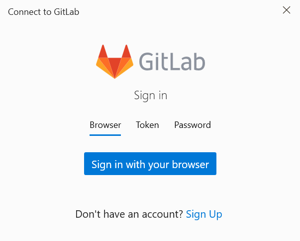
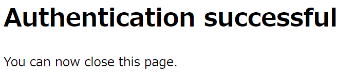
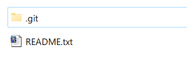

## 初期設定
### 開発者の名前
git config --global user.name "Yasuo Takemoto"
### 開発者のメールアドレス
git config --global user.email "yasuo_takemoto@magicsoftware.com"

## リポジトリの作成
git init

## 新しいリポジトリを作成する
git clone https://gitlab.com/yasuotakemoto1/GitTest.git

"GitTestフォルダを作成"+"git init"+同期

cd GitTest

git switch --create main

touch README.md

git add README.md

git commit -m "add README"

git push --set-upstream origin main

## 既存のフォルダをプッシュする

cd existing_folder

git init --initial-branch=main

git remote add origin https://gitlab.com/yasuotakemoto1/GitTest.git

git add .

git commit -m "Initial commit"

git push --set-upstream origin main

## 既存のGitリポジトリをプッシュする

cd existing_repo

git remote rename origin old-origin

git remote add origin https://gitlab.com/yasuotakemoto1/GitTest.git

git push --set-upstream origin --all

git push --set-upstream origin --tags

保存する場所のこと→リポジトリ

作業コピー
中央リポジトリから取得したローカル環境のリポジトリのこと。

中央リポジトリ　⇔　ローカルリポジトリ [ 作業コピー ]

フォルダにREADME.txtを追加

はじめてのGit

これは「はじめてのGit」の概要です。

ここで git status

Untracked files:
  (use "git add <file>..." to include in what will be committed)
        README.txt

nothing added to commit but untracked files present (use "git add" to track)

untracked files::バージョン管理の対象になっていない。追跡されていないファイルがある。

## ステージ済みに登録
git add README.txt

git add .

**ステージ済みになって初めてコミット可能となる**

git commit -m "初めてのコミット"

-m コミットメッセージ

## コミットログを確認する

git log

## ローカルリポジトリから中央リポジトリにプッシュ

## 中央リポジトリの最新情報を取得
git fetch

## 自分の作業ディレクトリと結合
git merge

## git pull
git fetch + git merge

## 中央リポジトリの情報を知る
git remote -v

## git push [リモートネーム] [ブランチネーム]

