# Mgice と Git を連携する環境を整える（初回のみ）

## 準備

以下の３種の神器を予めインストールしておきます。

- Git をインストールする  
  まず Git とはなにかですが、一般的にはバージョン管理ソフトと呼ばれる部類のものになります。ざっくり簡単に表現すると「様々なファイルの追加・編集・削除などの内容を保存しておき、別のコンピュータでも同じ状況を再現することができる」ものだと考えていただくのが良いかと思います。

https://git-scm.com/

- Tortoise Git をインストールする  
  TortoiseGit とは,Git をより扱いやすくするために開発された Windows 用ソフトウェアです。無料で扱うことができ、コマンドを打ち込んで実行するという少し初心者にはハードルの高い状態をこの TortoiseGit が解消してくれます。

https://tortoisegit.org/

- Magic compare & merge をインストールする  
  ファイルの一式とライセンスを手に入れてから、インストールをします。

- プロジェクトの受け入れ先をローカルフォルダに作る  
  基本的に「 C:\USER\~ 」のディレクトリにプロジェクト名と同じフォルダを作ります。
  作成したフォルダの中に「 mg 」「 ng 」２つのフォルダを作ります。
  - mg フォルダ：Magic のプログラム内容をインストールします
  - ng フォルダ：Anglar の内容をインストールします  
    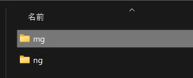

# すでに Git 上に存在するプロジェクトを初めて自分の環境に持って来る場合

準備が出来たら、いよいよプロジェクトの同期をとります。

## 同期をとる

1. Magic xpa 4.9 Enteerprise Studio を開く

   1. ファイルメニューから　バージョン管理＞ Git の設定　を開きます
      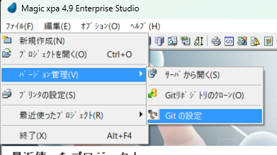
   1. 設定の中から　 Git 　を選び Git hab と Magic を紐づけます

   - 名前には Git hab へ登録しているサインイン名を入力します
   - メールには同じく登録しているメールアドレスを入力します
     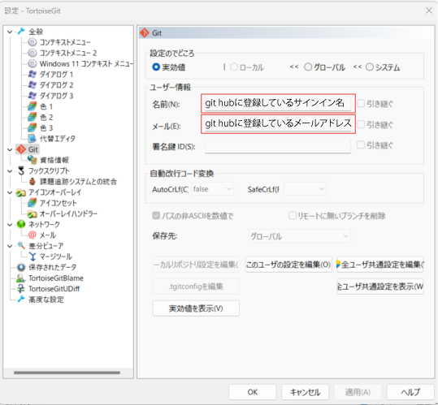

   1. 同期をとりたいプロジェクトを選びます

      1. ファイルメニュー＞バージョン管理＞ Git リポジトリのクローン　を選びます
         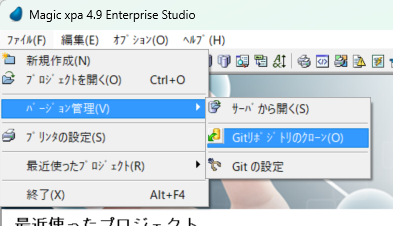
      1. Git hub から同期をとりたいプロジェクトの URL を設定し、ディレクトリが準備した「 mg 」フォルダにあることを確認します
         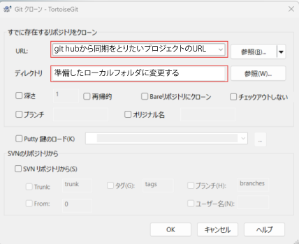  
         URL の場所はというと・・・  
         Git hub ににあるそれぞれのプロジェクトによって変わります。  
         プロジェクト内の「 <> Code ▼ 」ボタン＞「 Local 」タブ＞「 HTTPS 」に書かれている URL をコピーし、そのまま貼り付けます。  
         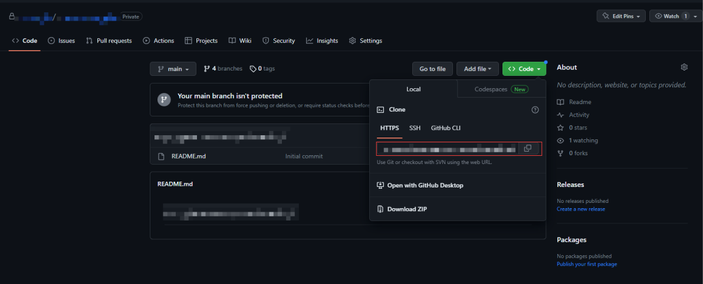
      1. 「ブランチ」にチェックをして「 develop 」と入力します
         Magic と Angula のプロジェクトでは develop から派生させたブランチでしか編集しません。
         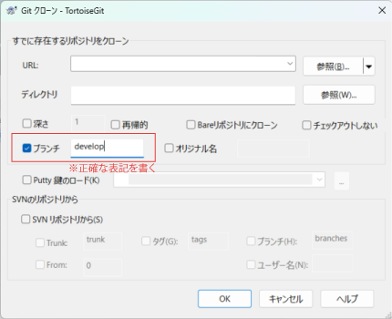
      1. 「OK」をします  
         実行ウィンドウに「成功」の文字が表示されたら「閉じる」ボタンで閉じます
         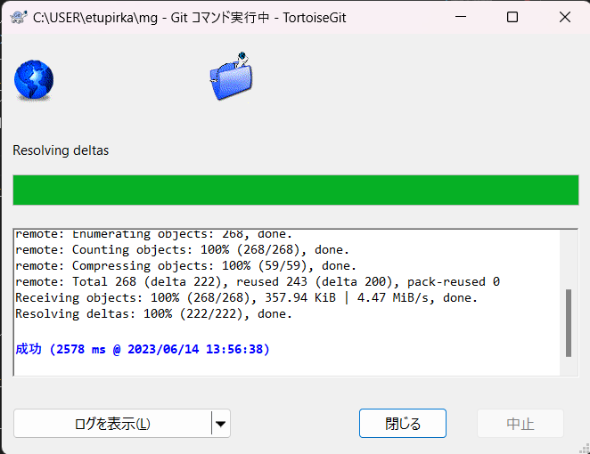
      1. ローカルフォルダを確認して、ini ファイルなど必要なファイルがあればフォルダ内に移植します。

      ## ※注意点※

      リポジトリをクローンする際に必ず注意したい点は「 develop 」の内容と同期させることです。  
       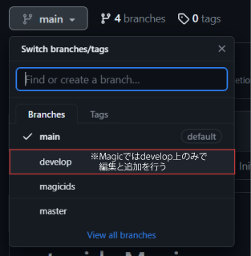  
       

   1. Compare & Merge の設定をします
      1. プロジェクトを開きます。確認の画面が出るので「OK」ボタンを押します。  
         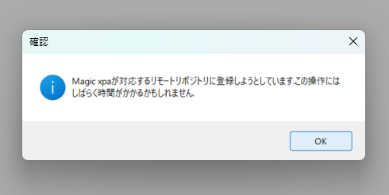
      1. 2 行目の Compare & Merge ユーティリティ設定が「×」の印なので「設定…」を押します  
         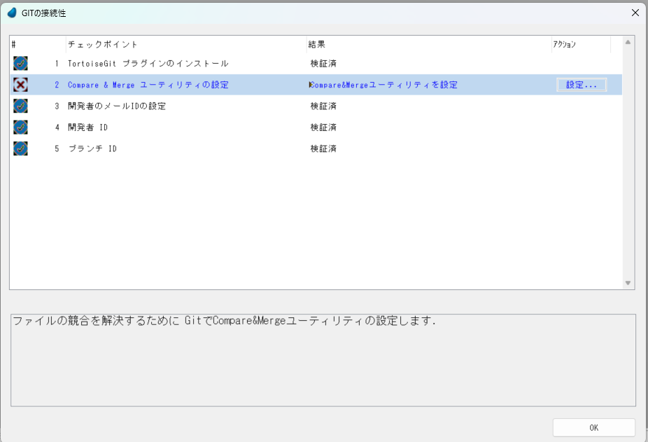
      1. ローカルフォルダが開き Compare & Merge に必要なフォルダが表示されます  
         その中でも「 merge.exe 」を開きます  
         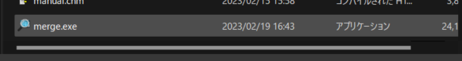
      1. するとユーティリティの設定が終わります  
         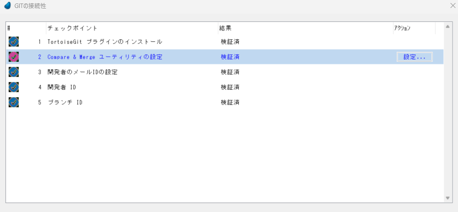
   1. コミットの準備をします

      1. プロジェクトが開いたらブランチが develop で開いているか確認してください
         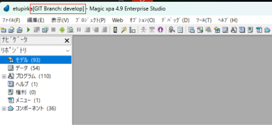

      1. ファイルメニューから  
         バージョン管理＞コミット　を行います
         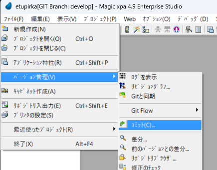
      1. コミット画面が表示されるのでコメントを書き込み、コミットボタンを押します。  
         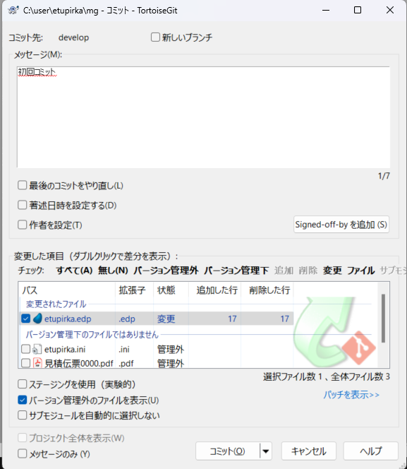
      1. 実行画面に「成功」画面が出たら、閉じるを押します。  
         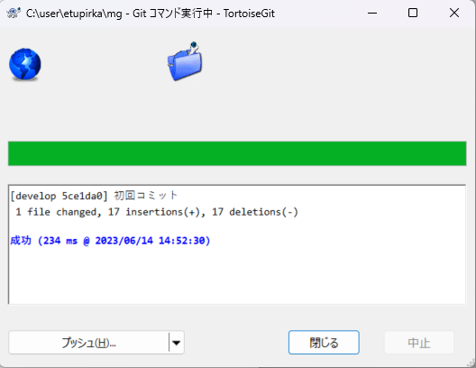

   1. Git flow を初期化します（初回同期だけの設定）

      1. ファイルメニューから  
         バージョン管理＞ Git Flow ＞ Git Flow の初期化  
         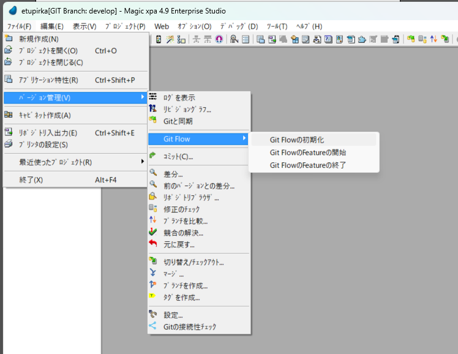
      1. 確認画面が出るので Yes で待ちます。
         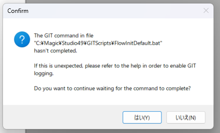  
         意味はヘルプをご参照ください
         file:///C:/Magic/Studio49/Help/index.htm?rhcsh=1%3Frhmapno%3D0#t=mergedProjects%2FTechnical%20Notes%2FConcept_Papers%2FConnecting_Magic_xpa_with_Git_Repository%2FTroubleshooting_Git_Command_Issues.htm&rhsearch=GITScripts%20xpa&rhhlterm=GITScripts%20xpa&rhsyns=%20

         「Yes」を押した後は完了したなどの表記は出ません。

## 編集を始める

1. Git hub からプルしてきます
1. 自分用の Feature を分岐させて編集を始めます
   1. ファイルメニューから
      バージョン管理＞ Git Flow ＞ Git Flow の Feature の開始  
      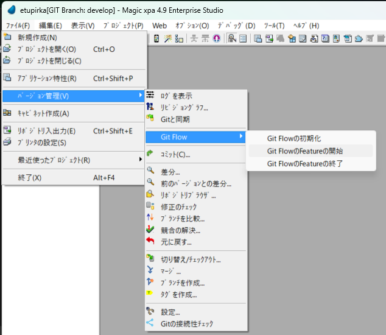
   1. 自分用の Feature 名をつける＞ＯＫボタン  
      
   1. Feature 名が設定したものだったら成功です  
      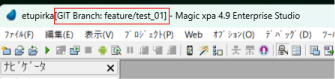

## 編集を終わる

1. コミットをする

   1. コミット先が自分用の Feature 名であることを確認します
   1. コメントを書きコミットします  
      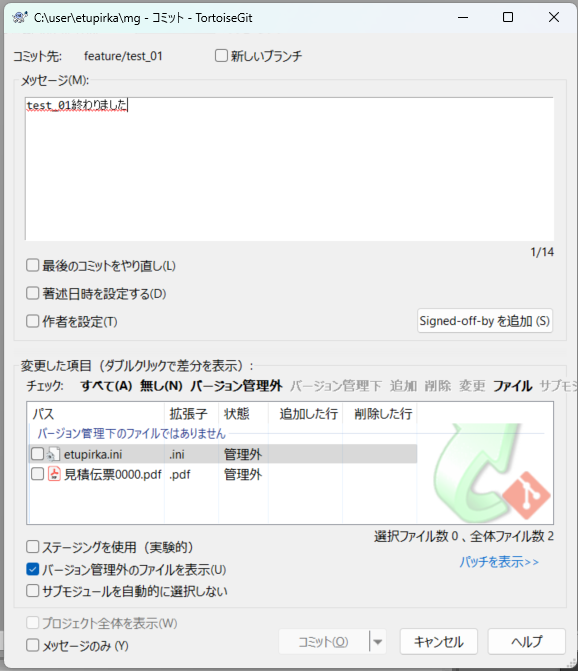
      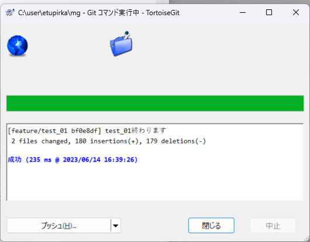

1. Feature を終了します
   1. ファイルメニューから
      バージョン管理＞ Git Flow ＞ Git Flow の Feature の終了  
      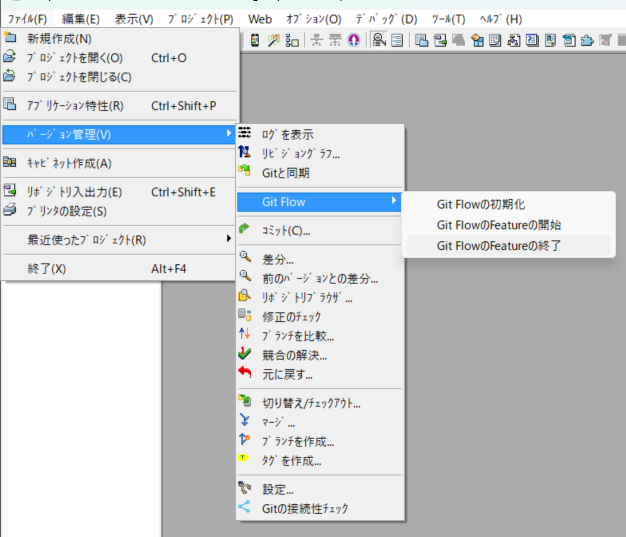
   1. Feature を開始したときにつけた名前を入力します  
      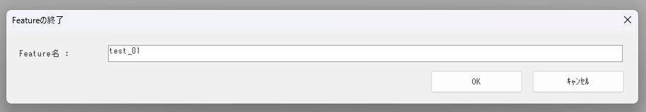
      以下の注意が出たら「はい」を押して待ちます  
      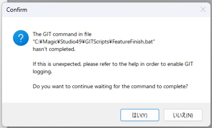
   1. ブランチが develop に戻っていることを確認します
      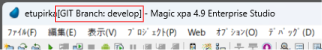

# Anglar の同期をとる

「 0300VSCode.md 」のファイルを参照します
